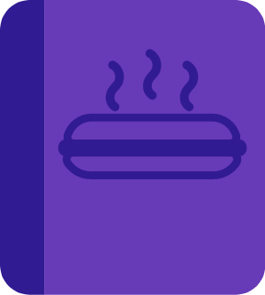

<h1>HotDocs 🌭</h1>

Flame-grilled API Documentations

## What is HotDocs?
HotDocs is a simple Template for API Documentations. You just have to edit the `data.json` File and you are good to go!

## How can I use it for my Project?
1. Download or clone this repo.
2. Edit to `data.json` file and insert your API details (endpoints, etc.)
3. You're done! Open the `index.html` file in your Browser and enjoy your beautiful-looking API Documentation!

## Why does this look so good?
Because of [Bulma](https://bulma.io)! Bulma is a free, 100% mobile responsive CSS Framework!
